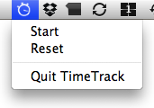
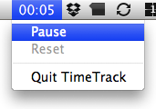

# TimeTrack

A *minimalist* time tracking app for Mac OS X 10.5+ which lives in your menu bar.

## Screenshots

 &nbsp; &nbsp; 

## Features

  - Start time tracking
  - Pause time tracking
  - Continue time tracking
  - Reset time tracking
  - Persistent across app restarts
  - Pauses when screen saver starts

## Download

[From GitHub](http://.....zip)

## Author

Torsten Becker <torsten.becker@gmail.com>
